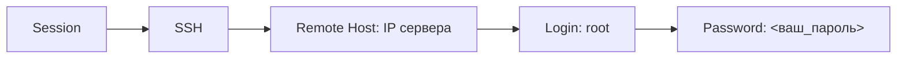

# 🌐 MULTI VPN Telegram Bot
**Универсальный бот для управления VPN-серверами с поддержкой нескольких протоколов. Слив скрипта который продается на просторах Telegram за 4000 рублей.**

---

## 🔧 Установка и настройка
### 1️⃣ Аренда сервера VPS
**Рекомендуемые параметры:**
| Параметр                | Для бота + VPN          | Только VPN         |
|-------------------------|-------------------------|-------------------|
| **ОС**                  | Ubuntu 22.04            | Ubuntu 22.04      |
| **HDD**                 | ≥ 20 ГБ                 | ≥ 10 ГБ           |
| **RAM**                 | ≥ 1 ГБ                  | ≥ 512 МБ          |
| **Локация**             | Европа (Амстердам, Турция) | Любая             |
| **Пропускная способность** | ≥ 200 Мбит/с           | ≥ 100 Мбит/с      |

**Проверенные хостинг-провайдеры:**
- [ProfitServer](https://ps.profitserver.pro/) — от 330₽/мес
- [JustHost](https://justhost.ru/) — от 500₽/мес

---

### 2️⃣ Подключение к серверу
**Инструменты для подключения:**
- 🪟 Windows: [MobaXTerm](https://mobaxterm.mobatek.net/download.html)
- 🐧 Linux/macOS: [WindTerm](https://github.com/kingToolbox/WindTerm/releases)

#### Инструкция для MobaXTerm:


#### Инструкция для WindTerm:
1. Новая сессия → SSH
2. Хост: `IP сервера`
3. Пользователь: `root`
4. Пароль: `<ваш_пароль>`

---

### 3️⃣ Установка бота

## Шаг 1: Обновление системы
```bash
sudo apt update && sudo apt upgrade -y
sudo apt install curl gettext -y
```
## Шаг 2: Установка Docker
```bash
curl -fsSL https://get.docker.com -o get-docker.sh
sudo sh ./get-docker.sh
sudo apt install docker-compose-plugin -y
```
## Шаг 3: Копирование файлов бота
```bash
Скопируйте папку бота на ваш сервер
```
## Шаг 4: Настройка переменных
```bash
cd VPNHubBot
nano .env  # Отредактируйте параметры
```

#### Ключевые параметры в `.env`:
```ini
TG_TOKEN=токен_бота
ADMIN_TG_ID=ваш_telegram_id
MONTH_COST=150,390,800  # Цены за 1/3/6 мес
YOOMONEY_TOKEN=ваш_токен
YOOMONEY_WALLET=номер_кошелька
# ... остальные параметры
```

> **Важно!** Получить Telegram ID можно через [@userinfobot](https://t.me/userinfobot)

#### Запуск бота:
```bash
sudo docker compose up -d
```

**Управление ботом:**
```bash
# Остановка
sudo docker compose down

# Просмотр логов
docker compose logs -f
```

---

### 4️⃣ Установка VPN-серверов
#### 🔐 VLESS + Reality
```bash
# Установка панели X-UI
bash <(curl -Ls https://raw.githubusercontent.com/mhsanaei/3x-ui/master/install.sh)
```
**После установки:**
1. Откройте панель: `http://SERVER_IP:55555`
2. Создайте подключение → Reality → "Get New Key"

#### 🌑 ShadowSocks
В панели X-UI:
1. "Добавить подключение"
2. Протокол: ShadowSocks
3. Нажмите "Создать"

#### 📦 Outline
```bash
# Автоматическая установка
sudo wget -qO- https://raw.githubusercontent.com/Jigsaw-Code/outline-server/master/install_server.sh | bash
```
**Сохраните вывод команды!** Он понадобится для настройки бота.

---

### 5️⃣ Добавление сервера в бота
1. В админ-панели бота: `Сервера → Добавить сервер`
2. Заполните параметры:
   - **Тип VPN:** VLESS/ShadowSocks/Outline
   - **Адрес:** IP:PORT (без http://)
   - **Данные от панели** (логин/пароль X-UI)
   - **Данные Outline** (из сохраненного вывода)

---

### ⚙️ Дополнительные настройки
#### Редактирование текста бота
```bash
cd VPNHubBot
sudo docker compose down
nano locale/ru/bot.po  # Редактируйте тексты
sh compile_translations.sh
sudo docker compose build
sudo docker compose up -d
```

#### Доступ к базе данных (PGAdmin)
1. Откройте: `http://SERVER_IP:5050`
2. Данные для входа из `.env`:
   - Email: `PGADMIN_DEFAULT_EMAIL`
   - Password: `PGADMIN_DEFAULT_PASSWORD`
3. Новый сервер → Имя: `admin`
4. Параметры подключения:
   ```ini
   Host: db_postgres
   Port: 5432
   Database: VPNHubBotDB
   Username: POSTGRES_USER
   Password: POSTGRES_PASSWORD
   ```

> ⚠️ **Внимание!** Изменения в БД выполняйте только при понимании последствий

---

## 🚀 Запуск
После выполнения всех шагов:
1. Перезапустите бота: `sudo docker compose restart`
2. Проверьте статус: `docker compose ps`
3. Начните работу с ботом в Telegram!

**Готово!** Ваш VPN-бот полностью настроен и готов к работе. Для управления используйте админ-панель в боте.
Спасибо за слив [@KodoDrive](https://t.me/KodoDrive_bio)
```
