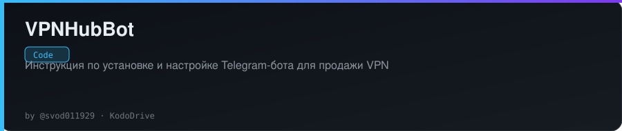
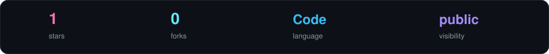

<!-- kododrive-readme-style -->

<div align="center">
  
</div>

<br/>

<div align="center">
  
</div>

<br/>

<p align="center">
  <a href="https://github.com/svod011929/VPNHubBot"></a>
  <a href="https://t.me/KodoDrive"></a>
  <a href="https://github.com/svod011929"></a>
</p>

<!-- /kododrive-readme-style -->

# 🚀 VPNHubBot — Телеграм-бот для управления VPN 🛡️

   

---

> ⚡ Управляйте VPN продажами и подписками через удобный Telegram-бот с поддержкой популярных VPN-протоколов и платёжных систем.

---

## 📑 Содержание

- [🎯 О проекте](#-о-проекте)
- [⚡ Быстрый старт](#-быстрый-старт-по-установке)
- [🖥️ Настройка VPS](#️-настройка-vps)
- [🤖 Установка и запуск бота](#-установка-и-запуск-бота)
- [📋 Настройка параметров](#-настройка-параметров)
- [🔧 Работа с ошибками](#-работа-с-ошибками)
- [✏️ Редактирование текстов](#-редактирование-текстов-бота)
- [🌐 Установка VPN-серверов](#-установка-vpn-серверов)
- [🗄️ Веб-панель pgAdmin](#-веб-панель-pgadmin)
- [💬 Поддержка](#-поддержка-и-контакты)

---

## 🎯 О проекте

**VPNHubBot** — это мультипротокольный Telegram-бот для автоматизации продажи VPN-подписок и управления серверами.

### ✨ Основные возможности

- 🔐 Поддержка VLESS (Reality), ShadowSocks, Outline и других протоколов
- 💳 Интеграция с ЮKassa, YooMoney, Lava, CryptoBot, Cryptomus и прочими платёжными системами
- 👨‍💼 Удобная админ-панель для управления серверами и подписками
- 🌍 Многоязычная поддержка (русский, английский и другие)
- ⚙️ Легкая настройка через файл `.env`
- 📊 Управление базой данных через pgAdmin
- 🚀 Запуск через Docker для быстрого развёртывания

---

## ⚡ Быстрый старт по установке

### ⚠️ Важно

Этот репозиторий служит руководством по установке и настройке. Для приобретения исходного кода, пишите в Telegram: **@KodoDrive**

Демо-бот: **@fx_vpnshop_bot**

---

## 🖥️ Настройка VPS

### Рекомендуемые параметры сервера

| Параметр | Рекомендация |
|----------|--------------|
| **Диск** | Минимум 20 ГБ |
| **Локация** | Европа (Амстердам, Турция, Бельгия) |
| **Скорость канала** | 200 Мбит/с на 100–120 пользователей |
| **ОС** | Ubuntu 22 |
| **Ресурсы для VPN** | Минимальные процессор и ОЗУ |
| **Ресурсы для бота** | Минимум 1 ГБ ОЗУ |

### 🏢 Рекомендуемые провайдеры

- **Profitserver** — 330₽
- **JustHost** — 500₽

---

## 🤖 Установка и запуск бота

### Шаг 1️⃣ : Подключение к серверу

После оплаты VPS вы получите **IP** и **пароль**.

#### SSH-клиенты

| ОС | Клиент | Загрузка |
|----|--------|----------|
| **Windows** | MobaXterm | https://mobaxterm.mobaxtermcom.com |
| **Linux/Mac** | WindTerm | https://github.com/kingToolbox/WindTerm/releases |

#### 🔹 Инструкция WindTerm

1. Откройте **"Сессия"** → **"Новая сессия"**
2. Выберите **SSH**
3. В поле **"Хозяин (H)"** введите IP сервера
4. Нажмите **"Соединить"**
5. На вкладке **"Account"** введите:
   - Пользователь: `root`
   - Пароль: из письма от провайдера

#### 🔹 Инструкция MobaXterm

1. **"Session"** → **SSH** → **"Remote host"**: IP сервера
2. **ОК** → выберите сервер
3. Логин: `root`, пароль: из письма

---

### Шаг 2️⃣ : Обновление системы и установка зависимостей

```bash
sudo apt update && sudo apt upgrade -y && sudo apt install curl gettext
```

### Шаг 3️⃣ : Установка Docker

```bash
curl -fSL https://get.docker.com -o get-docker.sh && \
sudo sh ./get-docker.sh && \
sudo apt install docker-compose-plugin
```

### Шаг 4️⃣ : Передача проекта на сервер

Передайте папку `VPNHubBot` из архива на сервер, например через SCP или прямо в клиенте SSH.

### Шаг 5️⃣ : Переход в директорию проекта

```bash
cd VPNHubBot
```

---

## 📋 Настройка параметров

### Редактирование файла `.env`

Откройте и заполните файл `.env` — основные поля:

```env
# Основные параметры бота
NAME=VPNHub                          # Имя бота
LANGUAGES=ru                         # Язык: ru или en
ADMIN_TG_ID=123456789               # Ваш Telegram ID (https://t.me/userinfobot)

# Подписки и цены (в рублях, через запятую)
MONTH_COST=199,399,599              # Цены за месяц
DEPOSIT=100,300,500,1000            # Суммы пополнения баланса
TRIAL_PERIOD=604800                 # Пробный период (в секундах, 7 дней = 604800)

# Бот-токен
TG_TOKEN=ВАШ_ТОКЕН_ОТ_BOTFATHER      # https://t.me/BotFather

# Платёжные системы (получите/создайте по инструкциям в файле .env)
YOOMONEY_TOKEN=xxx
LAVA_TOKEN=xxx
YOOKASSA_SHOP_ID=xxx
CRYPTOMUS_TOKEN=xxx
CRYPTOBOT_TOKEN=xxx

# Настройки PostgreSQL
POSTGRES_USER=vpn_user
POSTGRES_PASSWORD=strong_password
POSTGRES_DB=vpn_hub_db

# pgAdmin для управления БД
PGADMIN_DEFAULT_EMAIL=admin@example.com
PGADMIN_DEFAULT_PASSWORD=admin_password
```

⚠️ **Важно:** Не используйте спецсимволы в логинах/паролях!

### Шаг 6️⃣ : Настройка описания бота в BotFather

1. Перейдите в Telegram: **@BotFather**
2. Выполните `/mybots` → выберите своего бота → **Edit Bot**
3. Установите описание, команды и прочее оформление

---

## 🚀 Запуск бота

### Запуск бота

```bash
sudo docker compose up -d
```

### Остановка бота

```bash
sudo docker compose down
```

### Перезагрузка бота

```bash
sudo docker compose restart
```

✅ **Админ-панель** будет доступна через главное меню бота. Если кнопка не видна — прокрутите клавиатуру.

---

## 🔧 Работа с ошибками

### Просмотр логов в реальном времени

```bash
docker compose logs -f
```

### Просмотр логов конкретного сервиса

```bash
docker compose logs -f vpn_hub_bot
```

### Запись всех логов в файл

```bash
docker logs vpnhubbot-vpn_hub_bot-1 > bot_all.log 2>&1 &
```

### Проверка статуса контейнеров

```bash
docker compose ps
```

---

## ✏️ Редактирование текстов бота

Все текстовые строки бота хранятся в файлах перевода.

### Шаг 1: Остановите бота

```bash
sudo docker compose down
```

### Шаг 2: Отредактируйте файл перевода

Перейдите в директорию `locale` и нужный язык, отредактируйте файл `bot.po`

```bash
nano locale/ru/LC_MESSAGES/bot.po
```

### Шаг 3: Скомпилируйте переводы

```bash
sh compile_translations.sh
```

### Шаг 4: Постройте образы заново

```bash
sudo docker compose build
```

### Шаг 5: Запустите бота

```bash
sudo docker compose up -d
```

⚠️ **Этот порядок действий обязателен при каждом изменении текстов!**

---

## 🌐 Установка VPN-серверов

### 🔹 Вариант 1: VLESS + Reality

#### Установка панели XU-I

```bash
bash <(curl -Ls https://raw.githubusercontent.com/mhsanaei/3x-ui/master/install.sh)
```

Следуйте подсказкам:
- **Do you want to continue?** → `y`
- **Panel port** → укажите свой (любые 4 цифры)
- **Web base path** → нажмите Enter

#### Получение данных доступа

После завершения скрипта появятся:
- Логин
- Пароль
- Путь доступа

Запомните эти данные для следующего шага.

#### Вход в панель

Откройте в браузере:
```
http://<VPS_IP>:<PORT>/<PATH>
```

#### Создание подключения Reality

1. **"Подключения"** → **"Добавить подключение"**
2. Выберите **Reality**
3. Нажмите **"GET NEW KEY"**
4. Нажмите **"Создать"**

---

### 🔹 Вариант 2: ShadowSocks

1. Повторите шаги установки XU-I панели
2. **"Добавить подключение"**
3. Выберите протокол: **ShadowSocks**
4. Нажмите **"Создать"**

💡 **Совет:** Можете переименовать пользователя на `admin`

---

### 🔹 Вариант 3: Outline

#### Установка Outline

Только для новых серверов обновите систему:

```bash
apt update && apt install curl -y
```

Установите Outline:

```bash
sudo wget -qO- https://raw.githubusercontent.com/Jigsaw-Code/outline-server/master/src/server_manager/install_scripts/install_server.sh | bash
```

Если потребуется Docker:

```bash
sudo curl https://get.docker.com | sh
```

#### Получение ключей

После завершения скрипта появятся данные:

```json
{
  "apiUrl": "https://...",
  "certSha256": "..."
}
```

**Сохраните эти данные** — они нужны для настройки бота!

---

## 📌 Добавление VPN-сервера в бота

### Пошаговая инструкция

1. В боте: **"Сервера"** → **"Добавить сервер"**
2. Задайте **уникальное имя** (можно с эмодзи)
3. Введите **IP** и **порт** (при необходимости — webPath)
4. **Пароль от сервера** — любое значение (бот не использует)
5. Выберите **тип VPN** (VLESS, ShadowSocks, Outline)
6. Для **Outline** введите `apiUrl` & `certSha256` (копируйте целиком)
7. Для **VLESS/ShadowSocks** — продолжайте по инструкции
8. **Тип подключения:** HTTP
9. **Панель:** Sanae
10. **ID подключения** — скопируйте из панели, рядом с кнопкой "+"
11. **Логин/пароль** — из панели
12. ⚠️ Если на сервере были старые клиенты — сперва удалите их подключения

---

## 🗄️ Веб-панель pgAdmin

> ⚠️ Все действия в панели — только на свой страх и риск!

### Доступ к pgAdmin

Откройте в браузере:

```
http://<VPS_IP>:5050/
```

### Вход в систему

Используйте данные из файла `.env`:
- **Email:** `PGADMIN_DEFAULT_EMAIL`
- **Пароль:** `PGADMIN_DEFAULT_PASSWORD`

### Добавление сервера БД

1. **"Добавить новый сервер"**
2. На вкладке **"General"** введите **Имя:** `admin`
3. Откройте вкладку **"Connection"** и заполните:
   - **Имя/адрес хоста:** `db_postgres`
   - **Порт:** `5432`
   - **Служебная БД:** значение `POSTGRES_DB`
   - **Имя пользователя:** значение `POSTGRES_USER`
   - **Пароль:** значение `POSTGRES_PASSWORD`
4. Нажмите **"Save"**

✅ Теперь вы можете управлять БД напрямую через веб-интерфейс!

---

## ✅ Готово!

Бот установлен, VPN настроен — начинайте пользоваться! 🎉

---

## 💬 Поддержка и контакты

Если нужны исходники, демонстрация или техническая помощь:

📱 **Telegram:** [@KodoDrive](https://t.me/KodoDrive)  
🤖 **Демо-бот:** [@fx_vpnshop_bot](https://t.me/fx_vpnshop_bot)  
🌐 **Веб-сайт:** 

---

## 📊 Часто задаваемые вопросы (FAQ)

**Q: Можно ли запустить бота и VPN на разных серверах?**  
A: Да, это рекомендуется для больших объёмов трафика.

**Q: Какие платёжные системы поддерживаются?**  
A: ЮKassa, YooMoney, Lava, CryptoBot, Cryptomus и другие.

**Q: Как добавить новый язык?**  
A: Создайте новую папку в `locale`, скопируйте `bot.po` и переведите строки.

**Q: Какой минимальный процессор нужен?**  
A: Для 100–120 пользователей хватит дешёвого VPS с 1 ядром.

---

## 📜 Лицензия

MIT License — используйте в своих проектах свободно!

---

## 🙌 Благодарности

Спасибо всем, кто использует VPNHubBot и помогает его улучшать!

---

**© 2025 **  
**Последнее обновление:** Октябрь 2025

---

*Проект активно развивается. Следите за обновлениями в репозитории! ⭐*

---

<!-- kododrive-projects-block -->

## Проекты KodoDrive

Другие проекты автора: [профиль @svod011929](https://github.com/svod011929) · [Telegram](https://t.me/KodoDrive)

### VPN и инфраструктура

- [BuryatVPN — VPN-сервис + Telegram](https://github.com/svod011929/buryatvpn)
- [VPN Server Installer — VLESS + TLS](https://github.com/svod011929/vpn-server-installer)
- [3X-UI Auto Installer](https://github.com/svod011929/3x-ui-auto-installer)
- [AWG Bot Installer — AmneziaWG](https://github.com/svod011929/awg-bot-installer)
- [RemnaShop Installer](https://github.com/svod011929/remnashop-installer)
- [VPN Auto Installer — панели](https://github.com/svod011929/vpn-auto-installer)
- **VPNHubBot — Telegram VPN-бот** ← ты здесь

### Telegram и автоматизация

- [KDS Server Panel — SSH из Telegram](https://github.com/svod011929/KDS_Server_Panel)
- [Telegram → VK Poster](https://github.com/svod011929/telegram-to-vk-poster)
- [KDS Parser CryptoBot](https://github.com/svod011929/kds_parser_cryptobot)
- [Auction Bot](https://github.com/svod011929/auction-bot)
- [Invest Bot](https://github.com/svod011929/invest-bot)
- [Crypto Check Bot](https://github.com/svod011929/crypto-check-bot)
- [KodoRefStarsBot](https://github.com/svod011929/KodoRefStarsBot)

### Магазины и финансы

- [KodoCashFlow](https://github.com/svod011929/KodoCashFlow)
- [Telegram Crypto Shop](https://github.com/svod011929/telegram-crypto-shop)
- [TalkProfit](https://github.com/svod011929/talkprofit)

### Сайты

- [KodoDrive Portfolio](https://github.com/svod011929/kododrive-portfolio)
- [kododrive.github.io](https://github.com/svod011929/kododrive.github.io)

<!-- /kododrive-projects-block -->
